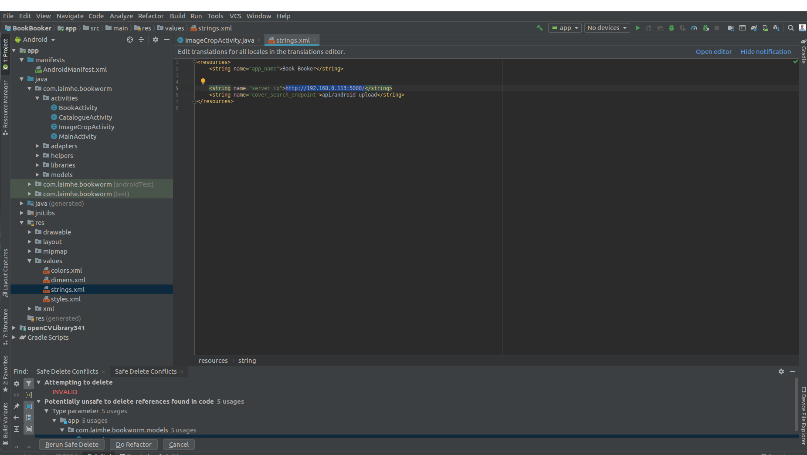
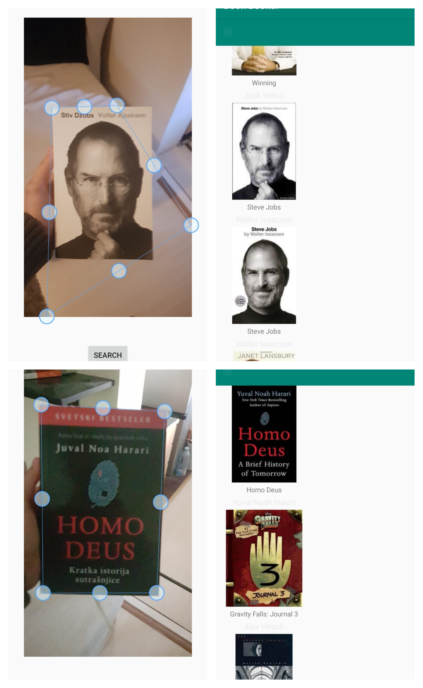

[![Forks][forks-shield]][forks-url]
[![Stargazers][stars-shield]][stars-url]
[![MIT License][license-shield]][license-url]
[![LinkedIn][linkedin-shield]][linkedin-url]


<!-- PROJECT LOGO -->
<br />
<p align="center">
  <a href="https://github.com/lucko515/search-book-by-cover-server">
    
  </a>

  <h3 align="center">Book Search Engine (Android App front-end)</h3>

  <p align="center">
    An application that allows user to search for their favorite book just by taking a picture of it.
    <br />
    <a href="https://github.com/lucko515/search-book-by-cover-server"><strong>Explore the docs »</strong></a>
    <br />
    <br />
  </p>
</p>


<!-- TABLE OF CONTENTS -->
## Table of Contents

* [About the Project](#about-the-project)
  * [Built With](#built-with)
* [Getting Started](#getting-started)
  * [Prerequisites](#prerequisites)
  * [Installation](#installation)
* [Usage examples](#usage-examples)
* [Dataset](#dataset)
* [Contributing](#contributing)
* [License](#license)
* [Contact](#contact)
* [Acknowledgements](#acknowledgements)


<!-- ABOUT THE PROJECT -->
## About The Project

<p align="center">
</img>
</p>

There are many ways to search for a book that you are interested in -  searching it by name, author, ISBN, and any other relevant features. That is all great, but the process is becoming very long as we introduce more and more features in the search system. And what if we want to find the cheapest place to buy the book? We would need to go to multiple websites and type the same query all over again! 

This open-source project tries to solve that problem by leveraging the power of Deep Learning and creating an engine that allows an end-user to take a picture of books' cover and find places where they can buy the book. 

This Book Search Engine is an open-source project that demonstrates a way of using Deep Learning in a real-world setting. 

It is opened for contributions. :-)


### Built With
* [Tensorflow](https://www.tensorflow.org/)
* [OpenCV](https://opencv.org/)
* [Android](https://developer.android.com/guide)
* [Volley](https://developer.android.com/training/volley)


<!-- GETTING STARTED -->
## Getting Started

To get a local copy up and running follow these simple example steps.

### Prerequisites

To run this project you'll need the newer version of the Android Studio and Java SDK installed.
The whole installation guide for your OS can be found here: https://developer.android.com/studio/install

### Installation

1. Clone the repo
```sh
git clone https://github.com/lucko515/search-book-by-cover-android-app.git
```
2. Open the project with your Android Studio

3. If you are running this project on the localhost, change IP in the resource file to your local IP.


<p align="center"> 
   
</p>

4. Start the Flaks server with the **server.py**
```sh
python(3) server.py
```
NOTE: The server side is in the other repository: https://github.com/lucko515/search-book-by-cover-server

5. Build the application on your mobile device **NOT emulator**


<!-- USAGE EXAMPLES -->
## Usage examples

<p align="center"> 
   
</p>
  
<!-- DATASET -->
## Dataset

Link to the dataset: https://www.kaggle.com/lukaanicin/book-covers-dataset

<!-- CONTRIBUTING -->
## Contributing

Let's improve this project together! :-)

Contributions are what make the open source community such an amazing place to be learn, inspire, and create. Any contributions you make are **greatly appreciated**. 

1. Fork the Project
2. Create your Feature Branch (`git checkout -b feature_name/NewFeature`)
3. Commit your Changes (`git commit -m 'Explain your commit'`)
4. Push to the Branch (`git push origin feature_name/NewFeature`)
5. Open a Pull Request


<!-- LICENSE -->
## License

Distributed under the MIT License. See `LICENSE` for more information.


<!-- CONTACT -->
## Contact

Luka Anicin - [@luka_anicin_fn](https://twitter.com/luka_anicin_fn) - luka.anicin@gmail.com

Server of the project repo: [https://github.com/lucko515/search-book-by-cover-server](https://github.com/lucko515/search-book-by-cover-server)

Android application front-end repo: [https://github.com/lucko515/search-book-by-cover-android-app](https://github.com/lucko515/search-book-by-cover-android-app)


<!-- ACKNOWLEDGEMENTS -->
## Acknowledgements
* [Img Shields](https://shields.io)
* [Android Opencv Camera Scanner](https://github.com/aashari/android-opencv-camera-scanner)
* [DEep Local Features (DELF) paper](https://arxiv.org/pdf/1612.06321.pdf)
* [DELF Reference implementation](https://www.dlology.com/blog/easy-landmark-image-recognition-with-tensorflow-hub-delf-module/)
* [Readme Templates](https://github.com/othneildrew)


<!-- MARKDOWN LINKS & IMAGES -->
[forks-shield]: https://img.shields.io/github/forks/lucko515/search-book-by-cover-android-app.svg?style=flat-square
[forks-url]: https://github.com/othneildrew/search-book-by-cover-android-app/network/members
[stars-shield]: https://img.shields.io/github/stars/lucko515/search-book-by-cover-android-app.svg?style=flat-square
[stars-url]: https://github.com/othneildrew/search-book-by-cover-android-app/stargazers
[license-shield]: https://img.shields.io/github/license/lucko515/search-book-by-cover-android-app.svg?style=flat-square
[license-url]: https://github.com/lucko515/search-book-by-cover-android-app/blob/master/LICENSE.txt
[linkedin-shield]: https://img.shields.io/badge/-LinkedIn-black.svg?style=flat-square&logo=linkedin&colorB=555
[linkedin-url]: https://www.linkedin.com/in/luka-anicin/
